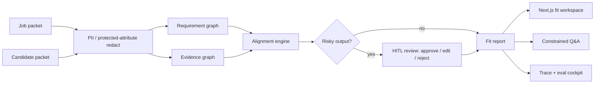
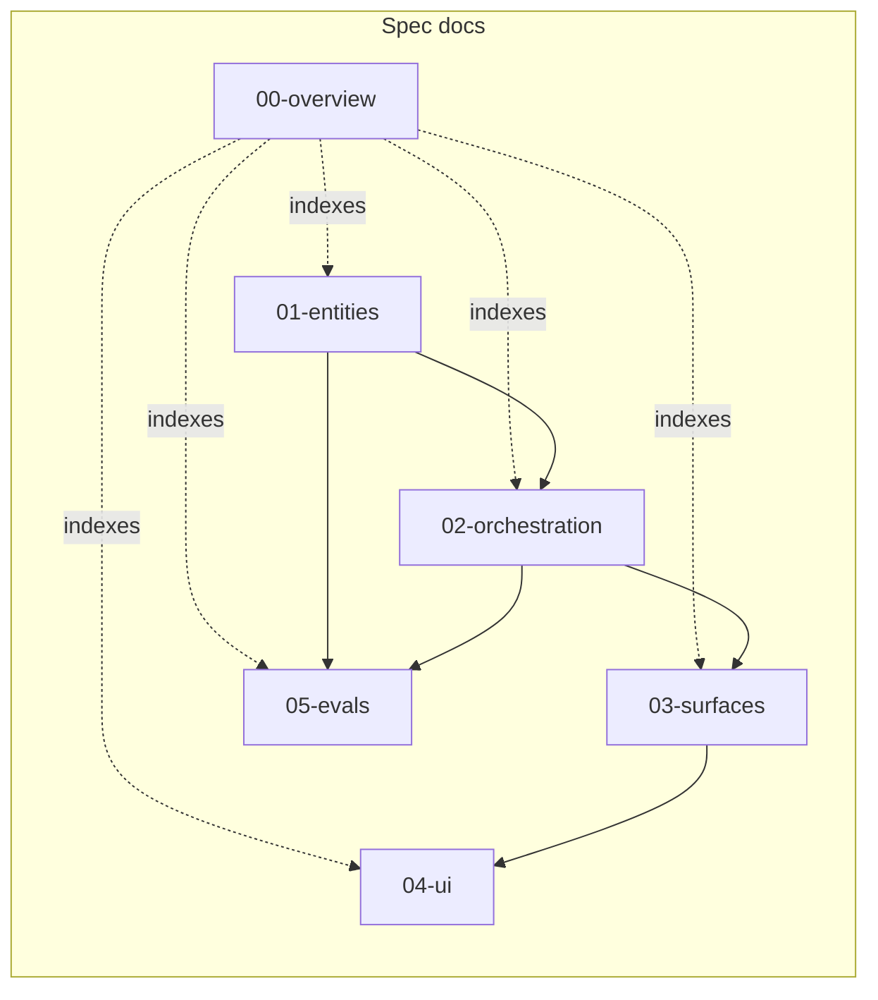

# 00 — Overview

## Purpose

This document pins the system-level decisions that every other spec in `docs/spec/` builds on: what RoleGraph is, what it is not, what it is built with, and how its pieces fit together at the highest level. It assumes the concept and does not re-argue it.

For the motivation and framing, see [`../concept.md`](../concept.md). For the shape of the artifacts produced by the system, continue to [`01-entities.md`](01-entities.md).

## System in one paragraph

RoleGraph is an evidence-grounded role-fit workbench. It ingests a **job packet** and a **candidate packet**, extracts a typed **requirement graph** and **evidence graph** with span-level provenance, produces an evidence-backed **fit report** (coverage, not candidate ranking), gates risky outputs through **human-in-the-loop review**, and exposes the whole flow through a Next.js workspace, a Hono surface, **LangGraph Studio** for visual orchestration, and a TS **MCP server** — with LangSmith-driven traces and evals underneath.

## In scope (v1)

- Job packet ingestion → typed `RequirementGraph` with citations.
- Candidate packet ingestion → typed `EvidenceGraph` with citations.
- Evidence-backed alignment engine producing a `FitReport` of `CoverageMatch`es.
- Constrained Q&A over the stored graphs and report.
- PII / protected-attribute redaction before analysis.
- Human review on risky outputs (approve / edit / reject) with audit log.
- Trace + eval cockpit backed by LangSmith.
- Hono REST surface + standalone MCP server built on `@modelcontextprotocol/sdk`; LangGraph Studio as the visual debugging surface.
- Next.js/React fit workspace as the primary UI.

## Out of scope (v1)

Reproduced and tightened from [`../concept.md`](../concept.md):

- Candidate-to-candidate ranking.
- Comparison against a real competing candidate pool.
- Interview scheduling.
- Outreach, email, or sourcing automation.
- Full ATS / hiring database features.
- Multi-tenant or multi-role-at-scale workflows.
- Multi-agent orchestration (single orchestrator is the v1 decision — see [`02-orchestration.md`](02-orchestration.md)).
- Role benchmark mode (deferred stretch; not specified in v1 and not referenced by other spec files except as "deferred").

## Tech stack — decisions, not options

The stack is **TypeScript end-to-end**. Backend and frontend share Zod schemas directly; no cross-language codegen.

| Layer | Choice | Why pinned here |
| --- | --- | --- |
| Language | TypeScript (`strict`) on Node.js 22 LTS | Backend + frontend share types and Zod schemas; Node 22 is the current LTS with stable LangGraph.js / LangChain.js support. |
| Orchestration | **LangGraph.js** (`@langchain/langgraph`) | `StateGraph` with `Annotation.Root` typed state, `interrupt` + `Command` for HITL, `MemorySaver` checkpointer. |
| Structured output + guardrails + HITL | **LangChain.js** (`langchain`, `@langchain/core`) | `model.withStructuredOutput(zodSchema)` for typed extraction; tool binding; provider-agnostic. |
| HTTP surface | **Hono** (`hono` + `@hono/zod-validator`) | Small, fast, Zod-native route validation, type-safe handlers, trivial adapter for the MCP server. |
| Schema | **Zod** in `packages/shared` | Single source of truth consumed by LangGraph.js nodes, Hono validators, LangChain.js `withStructuredOutput`, and the Next.js UI. |
| Observability + evals | LangSmith (JS SDK: `langsmith`) | Traces (online) + datasets + evaluators (offline) + online monitors. |
| Demo / external tool surface | **LangGraph Studio** (visual) + **`@modelcontextprotocol/sdk`** (TS MCP server) | Studio gives a first-party visual debugger for the LangGraph.js flow; the TS MCP SDK exposes the same flow as MCP tools to Claude/Cursor/Windsurf. Replaces the Langflow role from earlier drafts. |
| Frontend | Next.js 15 App Router + React + TypeScript | RSC + client islands for the fit workspace. |
| Styling / primitives | Tailwind CSS + shadcn/ui | Fast, consistent, accessible defaults. |
| Client data | TanStack Query v5 | Mutations + polling for HITL-paused runs. |
| Storage — artifacts | JSON files on disk under `data/` | Portfolio-grade; human-inspectable; no infra. Read/written via Node `fs/promises`. |
| Storage — audit + reviews | SQLite via `better-sqlite3` (`audit.sqlite`) | Synchronous, fast; transactional; queryable for eval analysis. |
| LangGraph checkpointer (v1) | `MemorySaver` | In-memory; runs don't survive process restart. Upgrade path: `SqliteSaver`. |
| Monorepo | `pnpm` workspaces: `apps/backend`, `apps/web`, `packages/shared` | `packages/shared` holds Zod schemas and TS types consumed by both apps. |
| Eval harness | **Vitest** (`vitest`) + LangSmith JS `evaluate` | CI-friendly; test-style ergonomics for per-node evaluators. |
| ID generation | `ulidx` | ULIDs with type-prefixed string validators. |
| Auth | **None in v1** (single-user local demo) | Explicit gap — upgrade path is OIDC in front of Hono. |
| Upgrade path — storage | Postgres + object store | Noted here; no v1 work. |
| Upgrade path — checkpointer | `SqliteSaver` or Postgres-backed checkpointer | Required to survive restarts while a run is paused. |

## Architecture

The system is a single orchestrator with specialized nodes. The flow is linear with one conditional branch (the HITL gate):

Node contracts and routing live in [`02-orchestration.md`](02-orchestration.md). Surfaces (Hono REST, MCP server, LangGraph Studio) live in [`03-surfaces.md`](03-surfaces.md). The UI that consumes those surfaces lives in [`04-ui.md`](04-ui.md). The eval harness that grades the pipeline lives in [`05-evals.md`](05-evals.md).

## Spec layout and dependency direction

Entities are the vocabulary the rest of the spec uses. Orchestration consumes entities and produces the runtime. Surfaces expose the runtime. UI consumes surfaces. Evals cross-cut orchestration and entities.

## Glossary

- **Packet** — a collection of documents uploaded together and treated as one analysis unit; either a `JobPacket` or a `CandidatePacket`.
- **Requirement** — a typed claim about what the role needs, with citations back to the job packet.
- **Evidence** — a typed claim about what the candidate has done or can do, with citations back to the candidate packet.
- **Coverage match** — the system's evidence-backed statement that a specific requirement is strongly / weakly / not / contradictorily supported by specific evidence.
- **Fit report** — the full output of an alignment run: all coverage matches, ambiguities, clarification questions, coverage score, and confidence. Never a hire/no-hire decision.
- **Citation** — a pointer to a `TextSpan` in a source document that grounds a claim.
- **Span** — `{document_id, start, end, text}`; the atomic unit of provenance.
- **Run** — one execution of the orchestration graph, identified by `run_id`; may be paused at the HITL gate.
- **Gate** — a conditional node in the orchestration graph that pauses a run when its triggers fire (see [`02-orchestration.md`](02-orchestration.md)).
- **Review decision** — the reviewer's `approve | edit | reject` response to a gated run, with rationale and optional patch.

## Deferred / not in this spec

- Role benchmark mode (stretch in [`../concept.md`](../concept.md)).
- Multi-tenant and auth beyond single-user local.
- Candidate-to-candidate ranking or pool comparison.
- Multi-agent orchestration.

## References

- Upstream: [`../concept.md`](../concept.md).
- Downstream: [`01-entities.md`](01-entities.md), [`02-orchestration.md`](02-orchestration.md), [`03-surfaces.md`](03-surfaces.md), [`04-ui.md`](04-ui.md), [`05-evals.md`](05-evals.md).
