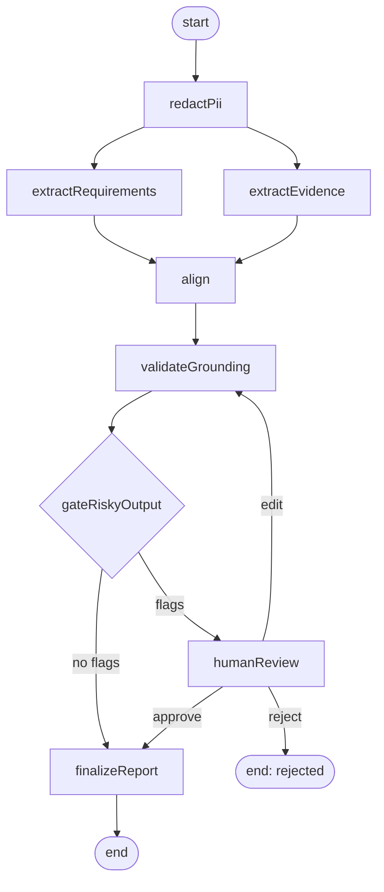

# 02 — Orchestration

## Purpose

This document specifies the runtime: the LangGraph.js state, the nodes that mutate it, the routing between them, the guardrail layers that wrap them, and the determinism settings under which they run. The artifacts consumed and produced are the types in [`01-entities.md`](01-entities.md).

Upstream: [`01-entities.md`](01-entities.md). Downstream: [`03-surfaces.md`](03-surfaces.md) (each surface endpoint routes to a graph entry), [`04-ui.md`](04-ui.md) (HITL gate triggers become review-queue items), [`05-evals.md`](05-evals.md) (every node has targeted eval metrics).

## Two graphs

RoleGraph runs two LangGraph.js graphs that share entity vocabulary but are otherwise independent:

- **`fitPipeline`** — the main flow: ingest packets → produce a `FitReport`.
- **`qaPipeline`** — a lightweight graph for constrained Q&A over an existing `FitReport`.

Splitting them keeps the main graph linear and the Q&A loop cheap. Both are built with `@langchain/langgraph`.

## Why a single orchestrator (not multi-agent)

Per [LangGraph.js's multi-agent guidance](https://langchain-ai.github.io/langgraphjs/), multi-agent is justified when sub-problems have distinct tools, distinct authority, or distinct personas that a single prompt cannot carry. None of those apply here: every node operates on the shared state, tool authority is uniform, and there is no benefit to personas. We use one orchestrator with specialized nodes. Multi-agent is explicitly deferred (see [`00-overview.md`](00-overview.md)).

## `fitPipeline` state

State is declared with `Annotation.Root` from `@langchain/langgraph`. Each channel takes the default replacement reducer unless otherwise noted.

```ts
import { Annotation } from "@langchain/langgraph";
import {
  JobPacket, CandidatePacket,
  RequirementGraph, EvidenceGraph,
  CoverageMatch, FitReport, ReviewDecision,
} from "@rolegraph/shared";

export const FitStateAnnotation = Annotation.Root({
  runId: Annotation<string>(),                               // run_*
  rolePacket: Annotation<JobPacket>(),
  candidatePacket: Annotation<CandidatePacket>(),
  redactionLog: Annotation<RedactionLog>(),
  requirementGraph: Annotation<RequirementGraph>(),
  evidenceGraph: Annotation<EvidenceGraph>(),
  coverageMatches: Annotation<CoverageMatch[]>({
    reducer: (_curr, next) => next,                          // whole-list replacement
    default: () => [],
  }),
  groundingReport: Annotation<GroundingReport>(),
  riskFlags: Annotation<RiskFlag[]>({
    reducer: (_curr, next) => next,
    default: () => [],
  }),
  reviewDecision: Annotation<ReviewDecision | null>({
    reducer: (_curr, next) => next,
    default: () => null,
  }),
  fitReport: Annotation<FitReport>(),
  traceRefs: Annotation<TraceRefs>(),
  editCycleCount: Annotation<number>({
    reducer: (curr, next) => (next ?? curr ?? 0),
    default: () => 0,
  }),
});

export type FitState = typeof FitStateAnnotation.State;
```

Supporting Zod schemas (all additive to [`01-entities.md`](01-entities.md); defined here because they are orchestration-internal, not persisted artifacts). These live in `apps/backend/src/orchestration/internal.ts`:

```ts
import { z } from "zod";

export const RedactionSpanSchema = z.object({
  documentId: z.string(),
  start: z.number().int().nonnegative(),
  end: z.number().int().positive(),
  category: z.enum([
    "pii.name", "pii.email", "pii.phone", "pii.address",
    "protected.age", "protected.gender", "protected.race",
    "protected.religion", "protected.disability",
    "protected.sexual_orientation", "protected.nationality",
    "protected.marital_status",
  ]),
  replacement: z.string(),
  confidence: z.number().min(0).max(1),
});
export type RedactionSpan = z.infer<typeof RedactionSpanSchema>;

export const RedactionLogSchema = z.object({
  spans: z.array(RedactionSpanSchema),
  protectedAttributeHit: z.boolean(),
});
export type RedactionLog = z.infer<typeof RedactionLogSchema>;

export const GroundingIssueSchema = z.object({
  location: z.enum(["rationale", "clarification_question", "ambiguity"]),
  claimText: z.string(),
  missingEvidence: z.boolean(),
  citationInvalid: z.boolean(),
});
export type GroundingIssue = z.infer<typeof GroundingIssueSchema>;

export const GroundingReportSchema = z.object({
  issues: z.array(GroundingIssueSchema),
  ok: z.boolean(),                                          // ok ≡ issues.length === 0
});
export type GroundingReport = z.infer<typeof GroundingReportSchema>;

export const RiskFlagCodeSchema = z.enum([
  "NEGATIVE_CONCLUSION",
  "MISSING_MUST_HAVE",
  "LOW_CONFIDENCE_MATCH",
  "PROTECTED_ATTRIBUTE_HIT",
  "UNSUPPORTED_CLAIM",
]);
export type RiskFlagCode = z.infer<typeof RiskFlagCodeSchema>;

export const RiskFlagSchema = z.object({
  code: RiskFlagCodeSchema,
  detail: z.string(),                                       // human-readable; rendered in the UI
  refs: z.array(z.string()),                                // match_*, req_*, ev_*
});
export type RiskFlag = z.infer<typeof RiskFlagSchema>;

export const TraceRefsSchema = z.object({
  langsmithRunUrl: z.string().url().nullable(),
  auditEventIds: z.array(z.string()),                       // aud_*
});
export type TraceRefs = z.infer<typeof TraceRefsSchema>;
```

## Node contracts (`fitPipeline`)

Nodes are registered with `new StateGraph(FitStateAnnotation).addNode(name, fn)`. Each node specifies inputs it reads from state, outputs it writes, and validation rules. Validation failures throw a typed error; they do **not** silently degrade outputs. Failure handling is specified in [Errors](#errors).

### 1. `redactPii`

- **Reads:** `rolePacket`, `candidatePacket`.
- **Writes:** returns `{ rolePacket, candidatePacket, redactionLog }` with redactions applied to `documents[*].text`.
- **Implementation:** a deterministic regex-based PII detector (`pii.*` categories) plus a small LLM classifier for protected attributes (`protected.*`). Replacements preserve byte length so downstream `TextSpan`s remain valid.
- **Determinism:** regex is deterministic; classifier is `temperature: 0`.
- **Validation:** each span has `start < end` within the original document; `replacement.length === end - start` (offset preservation).

### 2. `extractRequirements`

- **Reads:** `rolePacket` (post-redaction).
- **Writes:** `requirementGraph`.
- **Implementation:**
  ```ts
  import { ChatAnthropic } from "@langchain/anthropic";
  import { RequirementGraphSchema } from "@rolegraph/shared";

  const model = new ChatAnthropic({ model: "claude-opus-4-7", temperature: 0 });
  const structured = model.withStructuredOutput(RequirementGraphSchema, {
    name: "RequirementGraph",
    method: "jsonSchema",
  });
  const prompt = await loadPrompt("prompts/requirements@v{N}.md");
  const graph = await structured.invoke(prompt.format({ packet: rolePacket }));
  ```
- **Determinism:** `temperature: 0`; seed logged in `AuditEvent.seed` where the provider exposes one.
- **Validation (hard failures):**
  - Every `Requirement.citations` is non-empty (enforced by Zod).
  - Every `TextSpan` resolves (`document.text.slice(start, end) === span.text`).
  - `RequirementGraph.version` is `max(existing) + 1` for this packet; if first extraction, `1`.

### 3. `extractEvidence`

- **Reads:** `candidatePacket` (post-redaction).
- **Writes:** `evidenceGraph`.
- **Implementation:** same shape as `extractRequirements`, targeting `EvidenceGraphSchema` and `prompts/evidence@v{N}.md`.
- **Determinism:** `temperature: 0`.
- **Validation:** citation validity identical to `extractRequirements`.

### 4. `align`

- **Reads:** `requirementGraph`, `evidenceGraph`.
- **Writes:** `coverageMatches`.
- **Implementation:** hybrid, in two passes:
  1. **Candidate matching (deterministic).** Embed each `Requirement.text` and each `Evidence.text` (via `@langchain/openai`'s `OpenAIEmbeddings` or equivalent, pinned by model id). For each requirement, collect evidences whose cosine similarity exceeds a configurable threshold (default `0.65`).
  2. **Match rationalization (LLM).** For each requirement, an LLM call with `model.withStructuredOutput(CoverageMatchSchema)` decides the final `status`, `confidence`, selected `evidenceIds`, and writes a `rationale` that cites those evidences' IDs inline.
- **Determinism:** embeddings deterministic; LLM pass at `temperature: 0`.
- **Validation:**
  - Exactly one `CoverageMatch` per `Requirement`.
  - Invariant `status === "none" ⇔ evidenceIds.length === 0` (enforced by `CoverageMatchSchema`).
  - Every listed `evidenceId` exists in `evidenceGraph.evidences`.
  - `rationale` contains each listed evidence ID as a literal substring (used by the grounding validator in node 5).

### 5. `validateGrounding`

- **Reads:** `coverageMatches`, `evidenceGraph`.
- **Writes:** `groundingReport`.
- **Implementation:** deterministic TypeScript checker that, for each `CoverageMatch`:
  - confirms every evidence ID cited in `rationale` is in `evidenceIds`,
  - confirms `rationale` does not assert facts outside the cited evidences (small LLM classifier, `temperature: 0`).
- **Validation:** none — this node's *output* is the validation; it emits `GroundingIssue`s rather than failing.

### 6. `gateRiskyOutput`

- **Reads:** `coverageMatches`, `requirementGraph`, `redactionLog`, `groundingReport`.
- **Writes:** `riskFlags`.
- **Implementation:** deterministic rules engine. Each rule produces zero or more `RiskFlag`s with a stable `code`.

Rules (all tunable; values below are v1 defaults):

| `code` | Trigger |
| --- | --- |
| `NEGATIVE_CONCLUSION` | Aggregate `coverageScore < 0.4`, computed as `Σ(requirement.weight × matchScore) / Σ(weight)`, where `matchScore ∈ { strong: 1.0, weak: 0.5, none: 0.0, contradictory: 0.0 }`. |
| `MISSING_MUST_HAVE` | Any `CoverageMatch` with `status === "none"` whose `Requirement.weight >= 0.8`. One flag per such match. |
| `LOW_CONFIDENCE_MATCH` | Any `CoverageMatch` with `confidence < 0.6`. One flag per such match. |
| `PROTECTED_ATTRIBUTE_HIT` | `redactionLog.protectedAttributeHit === true`. One flag for the whole run. |
| `UNSUPPORTED_CLAIM` | `groundingReport.issues.length > 0`. One flag per issue. |

Routing (expressed via `addConditionalEdges`):
- If `riskFlags.length === 0` → route to `finalizeReport`.
- Otherwise → route to `humanReview` (graph interrupts).

### 7. `humanReview`

- **Reads:** `riskFlags`, `coverageMatches`, `requirementGraph`, `evidenceGraph`, `editCycleCount`.
- **Writes:** `reviewDecision` (via `Command.update`), increments `editCycleCount` when applicable.
- **Implementation:** uses the LangGraph.js `interrupt` primitive. The node surfaces the flagged state to the reviewer and pauses:
  ```ts
  import { interrupt } from "@langchain/langgraph";

  async function humanReview(state: FitState) {
    const decisionRaw: unknown = interrupt({
      reason: "review_required",
      riskFlags: state.riskFlags,
      draftMatches: state.coverageMatches,
      runId: state.runId,
      reportDraftId: /* ... */,
    });
    const decision = ReviewDecisionSchema.parse(decisionRaw);
    return { reviewDecision: decision };
  }
  ```
  The reviewer resolves the gate via `POST /reviews` (see [`03-surfaces.md`](03-surfaces.md)); the backend issues `graph.invoke(new Command({ resume: decision }), threadConfig)` to continue.
- **Checkpointer:** `MemorySaver` in v1. Upgrade path: `SqliteSaver` for restart-survivable pauses (see [`00-overview.md`](00-overview.md)).
- **Routing after resume (conditional edge from `humanReview`):**
  - `approve` → `finalizeReport` with unchanged draft.
  - `edit` → apply `changes` (JSON Patch via `fast-json-patch`) to the draft matches, re-run `validateGrounding` on the patched matches, then re-enter `gateRiskyOutput`. Bounded to `editCycleCount <= 2`; the 3rd patch cycle automatically writes a rejection with `rationale: "max edit cycles"`.
  - `reject` → write a terminal audit event and end the run without producing a `FitReport`.

### 8. `finalizeReport`

- **Reads:** `coverageMatches`, `requirementGraph`, `evidenceGraph`, `reviewDecision`.
- **Writes:** `fitReport`, one `AuditEvent` per executed stage, `traceRefs`.
- **Implementation:** deterministic TypeScript. Computes `coverageScore` (formula above), `confidence` (weighted mean of match confidences), truncates `clarificationQuestions` to 3, persists `FitReport` to `data/reports/{fitId}.json`, writes audit events to SQLite via `better-sqlite3`.

## Routing (`fitPipeline`)



`extractRequirements` and `extractEvidence` are independent; LangGraph.js fans them out in parallel (two parallel edges from `redactPii`).

## `qaPipeline`

Used by `POST /query` and the MCP `answer_question` tool. Takes a `FitReport` and a question; produces a cited answer or a grounded refusal.

### State

```ts
export const QAStateAnnotation = Annotation.Root({
  runId: Annotation<string>(),
  fitReport: Annotation<FitReport>(),
  question: Annotation<string>(),
  retrievedSpans: Annotation<TextSpan[]>({
    reducer: (_curr, next) => next,
    default: () => [],
  }),
  answer: Annotation<string | null>(),
  answerCitations: Annotation<TextSpan[]>({
    reducer: (_curr, next) => next,
    default: () => [],
  }),
  refusalReason: Annotation<string | null>(),
});

export type QAState = typeof QAStateAnnotation.State;
```

### Node: `answerQuery`

- **Reads:** `fitReport`, `question`.
- **Writes:** `answer`, `answerCitations` on success; `refusalReason` on refusal.
- **Implementation:** constrained RAG. An LLM planner (using `model.bindTools([...])`) selects which tools to call from the **tool registry** below. Retrieved spans are concatenated with the question in a constrained prompt. If no tool returns evidence that covers the answer, the node writes `{ answer: null, refusalReason: "insufficient_grounding" }` and does not generate an answer.
- **Determinism:** `temperature: ≤ 0.3` for rationale; `temperature: 0` for tool-call planning.
- **Refusal policy:** the answer must cite at least one `TextSpan` for every factual claim. If the planner cannot produce such an answer, the node **must** refuse rather than hallucinate citations.

## Tool registry (for `qaPipeline`)

Defined with `tool()` from `@langchain/core/tools` and bound via `model.bindTools([...])`. No free-form web tools. All tools operate on already-persisted artifacts.

| Tool | Zod input schema | Returns |
| --- | --- | --- |
| `lookupRequirement` | `z.object({ id: idSchema("req_") })` | `Requirement` or throws 404 |
| `lookupEvidence` | `z.object({ id: idSchema("ev_") })` | `Evidence` or throws 404 |
| `listMatches` | `z.object({ reportId: idSchema("fit_") })` | `CoverageMatch[]` |
| `retrieveSpans` | `z.object({ documentId: idSchema("doc_"), query: z.string(), k: z.number().int().positive().default(5) })` | `TextSpan[]` (top-k by cosine similarity) |

`retrieveSpans` uses the same embedding model as the alignment engine; results are top-k windows from the document's text.

## Guardrail layering

Guardrails are stacked — each layer has a narrow, auditable job:

1. **Pre-extraction redaction.** `redactPii` strips PII and protected attributes before any extraction prompt sees the packet. Offset-preserving replacements keep citations valid.
2. **Post-extraction citation validator.** Built into `extractRequirements` and `extractEvidence`; enforces that `TextSpan`s resolve to the verbatim substring in the document.
3. **Post-alignment grounding validator.** `validateGrounding` checks that rationales do not assert facts outside their cited evidences.
4. **Gate.** `gateRiskyOutput` translates validator + threshold outputs into reviewable `RiskFlag`s.
5. **Q&A refusal.** `answerQuery` refuses when it cannot ground every factual claim; the refusal is itself a first-class output.

Each layer is independently testable and independently eval'd (see [`05-evals.md`](05-evals.md)).

## Determinism knobs

| Knob | Value |
| --- | --- |
| Extraction / alignment LLM temperature | `0` |
| Grounding validator LLM temperature | `0` |
| Q&A rationale LLM temperature | `≤ 0.3` |
| Q&A tool-call planning temperature | `0` |
| Embedding model | pinned by name + version in config; same model used for alignment and `retrieveSpans` |
| Seed | logged per `AuditEvent` where the provider supports it |
| Prompts | versioned (`prompts/{name}@v{N}.md`); `AuditEvent.promptVersion` records the pinned version |

## Errors

- **Validation failure** inside a node → the run stops with a typed error derived from Zod's `SafeParseError`; no partial state is written to disk. The error payload is returned through whichever surface started the run.
- **LLM provider error** → retried with exponential backoff via LangChain.js's built-in retry wrapper (max 3 attempts); the final failure is recorded as an `AuditEvent` with `outputsHash: ""` and a typed error field.
- **HITL timeout** → v1 has no automatic timeout. Paused runs remain in the `MemorySaver` for the lifetime of the process; they do **not** survive restart in v1 (explicit gap; see upgrade path in [`00-overview.md`](00-overview.md)). A future version adds a reviewer SLA and auto-reject on timeout.

## References

- Upstream: [`00-overview.md`](00-overview.md), [`01-entities.md`](01-entities.md).
- Downstream: [`03-surfaces.md`](03-surfaces.md) maps each surface endpoint onto one of these graphs; [`04-ui.md`](04-ui.md) renders `riskFlags`, `traceRefs`, and the graphs themselves; [`05-evals.md`](05-evals.md) grades each node and guardrail layer independently.
