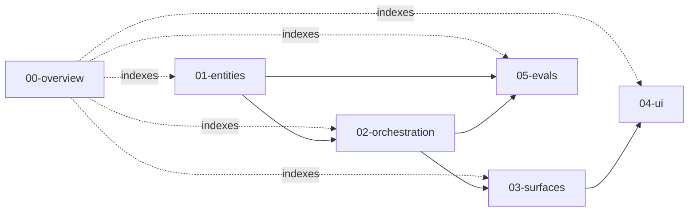

# RoleGraph — Concrete Flow Spec

This directory turns the [`../concept.md`](../concept.md) brief into a concrete implementation spec: entities, states, tools, canvases, UI panes, and evals. The spec is docs-only — no code lives here — but it is written tight enough that a follow-on session can scaffold the full system from these files without re-deriving decisions.

For motivation, framing, and the "why not AI recruiter" argument, read [`../concept.md`](../concept.md) first.

## Contents

| # | File | What it pins down |
| --- | --- | --- |
| 00 | [`00-overview.md`](00-overview.md) | System purpose, in/out scope, tech-stack decisions, architecture diagram, glossary, deferred items. |
| 01 | [`01-entities.md`](01-entities.md) | Zod schemas for every persisted artifact, ID scheme, versioning, storage layout. |
| 02 | [`02-orchestration.md`](02-orchestration.md) | LangGraph.js state (`Annotation.Root`), 8 node contracts across `fitPipeline` + `qaPipeline`, routing, gate triggers, tool registry, guardrail layering, determinism. |
| 03 | [`03-surfaces.md`](03-surfaces.md) | Hono REST endpoints, MCP tools via `@modelcontextprotocol/sdk`, LangGraph Studio wiring, error model. |
| 04 | [`04-ui.md`](04-ui.md) | Next.js routes, fit workspace layout, HITL review queue, trace inspector, eval cockpit, component inventory, data fetching, accessibility. |
| 05 | [`05-evals.md`](05-evals.md) | Dataset layout, metric definitions + thresholds + direction, LangSmith wiring, reviewer-agreement procedure, CI gate. |

## How to read

1. Start with **`00-overview.md`** to see the shape of the system and the tech choices that the rest of the spec assumes.
2. Read **`01-entities.md`** next — every subsequent file uses its types as vocabulary.
3. Read **`02-orchestration.md`** to see how nodes produce and consume those entities.
4. Read **`03-surfaces.md`** and **`04-ui.md`** in parallel — surfaces define the contract, UI defines the consumer.
5. Read **`05-evals.md`** last — it cross-cuts everything above and defines how the system is graded.

## Dependency direction

## Verification checklist

A spec is ready for implementation when all of the below hold. See the relevant section of each file for the source of truth; the bullets below are only cross-file assertions.

- [x] All six files plus this `README.md` exist under `docs/spec/`.
- [x] Every entity in [`01-entities.md`](01-entities.md) is referenced by name in at least one of `02/03/04/05` (`PacketBase` and `Relationship` are explicitly carved out as internal/reserved types — see [`01-entities.md`](01-entities.md#cross-cutting-conventions)).
- [x] Every REST endpoint in [`03-surfaces.md`](03-surfaces.md) has a matching UI consumer in [`04-ui.md`](04-ui.md#endpoint--ui-consumer-map); no endpoint is server-only in v1.
- [x] Every HITL trigger `code` in [`02-orchestration.md`](02-orchestration.md) has a matching review-queue behavior in [`04-ui.md`](04-ui.md#risk-flag--review-queue-behavior).
- [x] Every metric key in [`05-evals.md`](05-evals.md) has a visible tile in [`04-ui.md`](04-ui.md#required-tiles-one-per-metric).
- [x] All mermaid blocks use valid `flowchart` syntax (4 blocks: 2 in `00-overview.md`, 1 in `02-orchestration.md`, 1 here).
- [x] All intra-spec links resolve (checked by file existence + anchor-slug match).
- [x] [`../concept.md`](../concept.md) is unchanged; concept-level claims are not re-argued in the spec.
